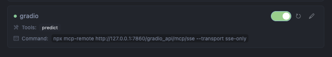
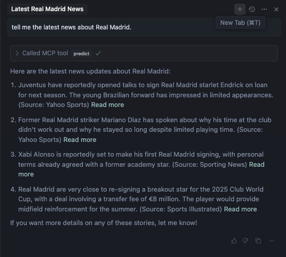

Gradio で簡単に MCP Server を作ることができるようになったみたいなので、試してみました。
https://www.gradio.app/guides/building-mcp-server-with-gradio

最初は単純にローカルで動かして満足したんですが、Gradio を開発しているの Hugging Face なので、Space にコードをおけば、簡単なリモート mcp サーバーに出来るのではと思い試してみました。

## プロジェクト作成

```zsh
uv init gradio-mcp-server
cd gradio-mcp-server
```

## Gradio と duckduckgo-search をインストール

```zsh
uv add "gradio[mcp]" duckduckgo-search
```

## コードを書く

基本的に、Gradio でアプリを作るのと全く同じです。違うのは launch に`mcp_server=True`を渡すことです。
`uv init`で生成される、main.py をそのまま使っています。

`main.py`

```python
import gradio as gr
from duckduckgo_search import DDGS


def news(
    keywords: str,
    region: str = "wt-wt",
    safesearch: str = "moderate",
    timelimit: str | None = None,
    max_results: int | None = None,
) -> list[dict[str, str]]:
    """DuckDuckGo news search. Query params: https://duckduckgo.com/params.

    Args:
        keywords: keywords for query.
        region: wt-wt, us-en, uk-en, ru-ru, etc. Defaults to "wt-wt".
        safesearch: on, moderate, off. Defaults to "moderate".
        timelimit: d, w, m. Defaults to None.
        max_results: max number of results. If None, returns results only from the first response. Defaults to None.

    Returns:
        List of dictionaries with news search results.
    """
    # Fix: Use the keywords parameter instead of hardcoded "sun"
    results = DDGS().news(keywords=keywords, region=region,
                          safesearch=safesearch, timelimit=timelimit, max_results=max_results)
    return list(results)  # Convert generator to list and return it


# Create a Gradio interface for the news function
demo = gr.Interface(
    fn=news,
    inputs=[
        gr.Textbox(label="Keywords"),
        gr.Dropdown(["wt-wt", "us-en", "uk-en"],
                    label="Region", value="wt-wt"),
        gr.Dropdown(["on", "moderate", "off"],
                    label="Safe Search", value="moderate"),
        gr.Dropdown([None, "d", "w", "m"], label="Time Limit", value=None),
        gr.Number(label="Max Results", value=10)
    ],
    outputs=gr.JSON(),
    title="News Search",
    description="Search for news using DuckDuckGo"
)

demo.launch(mcp_server=True)
```

## サーバーを起動する

```zsh
uv run python main.py

warning: `VIRTUAL_ENV=/Users/koji/Desktop/dev/mcp/.venv` does not match the project environment path `.venv` and will be ignored; use `--active` to target the active environment instead
* Running on local URL:  http://127.0.0.1:7860
* To create a public link, set `share=True` in `launch()`.

🔨 MCP server (using SSE) running at: http://127.0.0.1:7860/gradio_api/mcp/sse
```

localhost:7860 にアクセスすると、Gradio UI にが表示されます。位置付けとしては簡易 Debugger という感じです。

<video src="./gradio-mcp.mov" controls="controls" width="600" height="400"></video>

## MCP Client に MCP Server を追加

上記の動画の中たに出てきた、設定をそのままコピーして、貼り付けます。
今回は Client として Cursor を使いました。

```json
"gradio": {
      "command": "npx",
      "args": [
        "mcp-remote",
        "http://127.0.0.1:7860/gradio_api/mcp/sse",
        "--transport",
        "sse-only"
      ]
    }
```

問題なく、認識されました。



## MCP Server をテスト

Cursor の Chat に以下を prompt として入力して、テストします。

```
tell me the latest news about Real Madrid.
```



default で max_results=10 しているにもかかわらず、返ってきたのが 4 件なので、微妙ではありますが、
一応は動いしているのかなぁという感じです。
以前、TypeScript で同じく DuckduckGo の検索を作った時と比べるとだいぶコードを書く量が少ない気がします。
Debug ツールとわざわざ特定のコマンド叩かず立ち上げられるのも良い気がします。

## Hugging Face Space で動かす

Space を作ったのですが、Build がうまく通らず、https://huggingface.co/spaces/wjlgatech/mcp-demo1をduplicateしてコードを上げたら動きました。

ただ、やはりローカルで動かすよりは反応が遅いです。尚且つ、何回か MCP server を正しく検知できないみたいなこともあり、結構不安定です w

Hugging Face Spaces
https://huggingface.co/spaces/baxin/news-search-mcp

```
"gradio": {
      "command": "npx",
      "args": [
        "mcp-remote",
        "https://baxin-newssearch-mcp.hf.space/gradio_api/mcp/sse",
        "--transport",
        "sse-only"
      ]
    }
```


